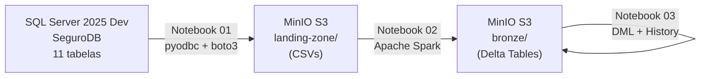
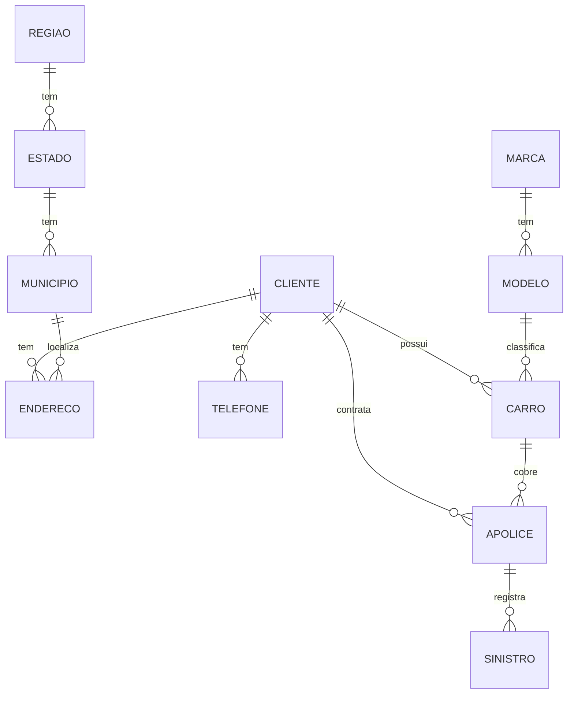

# Trabalho 2 — Pipeline SQL Server → Delta Lake

## Objetivo

Implementar um pipeline de dados completo que:

1. **Extrai** todas as tabelas do banco **SeguroDB** (SQL Server 2025) e grava em CSV no MinIO (`landing-zone`)
2. **Converte** os CSVs para o formato **Delta Lake** no bucket `bronze`
3. **Executa operações DML** (INSERT, UPDATE, DELETE) nas tabelas Delta com suporte a Time Travel e histórico de auditoria

## Arquitetura

## Stack tecnológica

| Componente | Versão | Papel |
|---|---|---|
| SQL Server 2025 Dev | Docker | Banco de dados fonte |
| MinIO | RELEASE.2025-02 | Object storage S3-compatible |
| Apache Spark | 3.5.3 | Motor de processamento distribuído |
| Delta Lake | 3.2.0 | Formato ACID com time travel |
| Python | 3.11 | Linguagem dos notebooks |
| UV | latest | Gerenciador de pacotes Python |
| Docker Compose | v2 | Orquestração dos serviços |

## Banco de dados — SeguroDB

Domínio: **seguros de automóvel**. 11 tabelas inter-relacionadas:

| Tabela | Descrição | Registros |
|---|---|---|
| regiao | Regiões do Brasil | 5 |
| estado | Estados da federação | 27 |
| municipio | Municípios | 40 |
| marca | Marcas de veículos | 10 |
| modelo | Modelos de veículos | 20 |
| cliente | Pessoas físicas seguradas | 60 |
| endereco | Endereços dos clientes | 60 |
| telefone | Telefones dos clientes | 50 |
| carro | Veículos segurados | 50 |
| apolice | Apólices de seguro | 32 |
| sinistro | Sinistros/ocorrências | 20 |

## Notebooks

| # | Notebook | Descrição |
|---|---|---|
| 00 | `00_setup_sqlserver.ipynb` | Cria SeguroDB, DDL das 11 tabelas, carga dos CSVs |
| 01 | `01_sqlserver_to_landing.ipynb` | Extrai tabelas → MinIO landing-zone (CSV) |
| 02 | `02_landing_to_bronze.ipynb` | CSV → Delta Lake no bucket bronze |
| 03 | `03_dml_delta.ipynb` | INSERT / UPDATE / DELETE + Time Travel |
