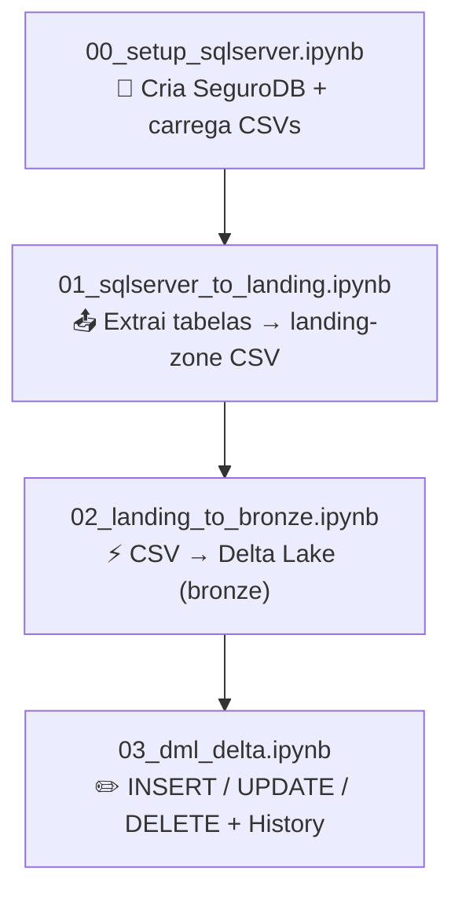

# Pipeline — Etapas detalhadas

O pipeline é composto por **4 notebooks** executados em sequência.

## Visão geral



---

## Notebook 00 — Setup SQL Server

**Arquivo:** `notebooks/00_setup_sqlserver.ipynb`

Prepara o ambiente de banco de dados:

1. Conecta ao SQL Server via `pyodbc` (ODBC Driver 18)
2. Cria o banco `SeguroDB` se não existir
3. Executa o DDL das 11 tabelas (com PKs e FKs)
4. Carrega os CSVs da pasta `data/` em lotes de 2.000 registros
5. Valida a carga com COUNT por tabela

**Tecnologias:** `pyodbc`, `pandas`, `python-dotenv`

---

## Notebook 01 — SQL Server → MinIO Landing Zone

**Arquivo:** `notebooks/01_sqlserver_to_landing.ipynb`

Etapa de **extração** (E do ELT):

1. Conecta ao MinIO via `boto3` e cria o bucket `landing-zone` se necessário
2. Descobre automaticamente todas as tabelas via `INFORMATION_SCHEMA.TABLES`
3. Para cada tabela:
   - Executa `SELECT * FROM dbo.{tabela}` → pandas DataFrame
   - Serializa para CSV em memória (`StringIO`)
   - Envia para `s3://landing-zone/{tabela}.csv` via `s3.put_object()`
4. Valida: lista todos os objetos no bucket com tamanho e data

**Resultado:**
```
s3://landing-zone/
├── regiao.csv       (5 registros)
├── estado.csv       (27 registros)
├── municipio.csv    (40 registros)
├── marca.csv        (10 registros)
├── modelo.csv       (20 registros)
├── cliente.csv      (60 registros)
├── endereco.csv     (60 registros)
├── telefone.csv     (50 registros)
├── carro.csv        (50 registros)
├── apolice.csv      (30 registros)
└── sinistro.csv     (20 registros)
```

---

## Notebook 02 — Landing Zone → Delta Lake Bronze

**Arquivo:** `notebooks/02_landing_to_bronze.ipynb`

Etapa de **transformação e carga** no formato Delta Lake:

1. Cria SparkSession com suporte a Delta Lake e S3A (MinIO)
2. Configura o conector `hadoop-aws` apontando para MinIO
3. Cria o bucket `bronze` no MinIO
4. Para cada CSV no landing-zone:
   - Lê com `spark.read.csv(..., header=True, inferSchema=True)`
   - Escreve em Delta com `df.write.format('delta').mode('overwrite').save(...)`
5. Valida com `DeltaTable.isDeltaTable()` e count de registros

**Resultado:**
```
s3://bronze/
├── regiao/
│   ├── _delta_log/     ← transaction log ACID
│   └── part-*.parquet  ← dados em Parquet
├── estado/
├── municipio/
...
└── sinistro/
```

**Configuração S3A:**

```python
.config('spark.hadoop.fs.s3a.endpoint', 'http://localhost:9020')
.config('spark.hadoop.fs.s3a.access.key', 'minioadmin')
.config('spark.hadoop.fs.s3a.path.style.access', 'true')
```

---

## Notebook 03 — DML nas tabelas Delta

**Arquivo:** `notebooks/03_dml_delta.ipynb`

Demonstra as três operações de modificação de dados sobre as tabelas Delta:

### INSERT

Adiciona 3 novos clientes e 2 novas apólices via `df.write.format('delta').mode('append')`.

### UPDATE

Reajusta em **10%** o `valor_premio` das apólices com cobertura 'Completo' e status 'ativa', usando a API `DeltaTable.update()`:

```python
dt_apolice.update(
    condition=(col('tipo_cobertura') == 'Completo') & (col('status') == 'ativa'),
    set={'valor_premio': col('valor_premio') * lit(1.10)}
)
```

Também usa Spark SQL para marcar apólices vencidas como inativas:

```sql
UPDATE delta.`s3a://bronze/apolice`
SET status = 'inativa'
WHERE status = 'vencida'
```

### DELETE

Remove sinistros com status 'cancelado' e sinistros de apólices inativas:

```python
dt_sinistro.delete(condition=col('status') == 'cancelado')
```

### DESCRIBE HISTORY

Exibe o log completo de transações de cada tabela modificada:

```python
DeltaTable.forPath(spark, path).history().show()
```

### Time Travel

Lê a tabela `apolice` como estava antes dos UPDATEs (`versionAsOf=0`) e compara com a versão atual para mostrar o efeito do reajuste.
